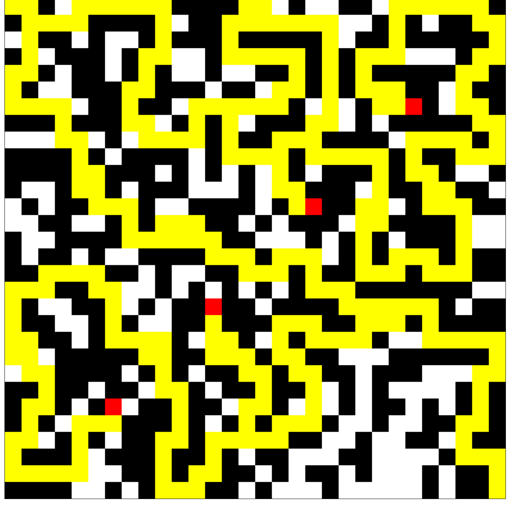

# An evolutionary algorithm for maze generation 

## Requirements

* [g++](https://gcc.gnu.org/) or any C++ compiler that supports C++ 17 or above.

## Getting started

* Clone the repo
* cd into the directory
* Compile `genetic_3.cpp` with the following options: 
    g++ -std=c++17 -O3 -Wl,--stack=16777216 -pthread genetic_3.cpp -o `executable_name`
    For clang on OSX, use: g++ -std=c++17 -O3 -Wl,-stack_size -Wl,0x1000000 -pthread genetic_3.cpp -o `executable_name`
* The program will generate mazes upto 120 in number of size 30*30, most of which will have a path from the upper left corner to the lower right corner.
* The mazes will be written into `genetic_3_results_save_2.txt`, stored as a 30*30 csv of 1's and 0's. Copy one of the mazes into a separate file. For an example of what that would look like, look at the contents of `pretty/demo_1.txt`.
* Then load up `pretty/index.html` on your browser, and choose the newly created file containing that one maze using the **Choose file** button. 
* Wait for a couple of seconds as the program solves the maze. Once the maze is solved, it will load up and you should see something like this:

* Then, feel free to play around with the options to see the checkpoints, ordinary solution and solution with checkpoints! 
* Here's one of the mazes generated using the program.

* Here's another one of the mazes.

## Overview of the program

* The program is based on the paper: D. Ashlock, C. Lee and C. McGuinness, "Search-Based Procedural Generation of Maze-Like Levels," in IEEE Transactions on Computational Intelligence and AI in Games, vol. 3, no. 3, pp. 260-273, Sept. 2011, doi: 10.1109/TCIAIG.2011.2138707.
* Here's a brief summary of the program design and some implementation details:
    * The goal is to create a 30 * 30 maze that starts at the upper left corner and ends at the lower right corner.
    * We represent the maze using a 30 * 30 array of type boolean, false if the cell is empty and true if the cell is blocked by a wall.
    * We create 120 such mazes, and that is our starting population. The mazes are randomly created, such that about 5% of the cells are walls and the rest are empty. So the mazes start out mostly empty
    * We then pick 7 of them randomly and calculate the fitness of each of them. 
    * Let's go on a short detour to talk about 'fitness':
        * Remember that this is an evolutionary algorithm. In nature, it's all survival of the fittest.
        * So, we need to evaulate the fitness of a maze. I'll talk about the simplest fitness expression used in the paper:
            * The paper cites 'checkpoints' to be placed at random places in the maze, since the algorithm tends to create 'direct' solutions from the start to the end, and that's no fun.
            * The algorithm is supposed to prefer mazes that have a path going through all the checkpoints. So our 'evolution' is biased to select more 'fun' mazes in a sense. 
            * The default checkpoints are (6, 24), (12, 18), (18, 12) and (24, 6)
            * If the maze does not have any such path from the entrance to the exit passing through all the checkpoints, its fitness is 0.
            * Else, the fitness is defined as the length of the shortest path from the entrance to exit passing through all the points. 
            * The path finding algorithm I used is described in another paper: D. A. Ashlock, T. W. Manikas and K. Ashenayi, "Evolving A Diverse Collection of Robot Path Planning Problems," 2006 IEEE International Conference on Evolutionary Computation, 2006, pp. 1837-1844, doi: 10.1109/CEC.2006.1688530.
            * The algorithm is essentially dynamic programming.
    * Back where I left off, in each iteration, 
        * Pick 7 mazes randomly
        * Sort by fitness.
        * Pick the fittest 2 and apply some 'evolution' on them 
            * In the program, the fittest two randomly have their bits exchanged at a predefined probability
            * This process is called 'uniform crossover' and the predefined probability of it happening is 0.05
            * Then, each individual maze is subject to 'uniform mutation', where a particular maze's bits are randomly flipped at a probability of 0.01
        * The 'post-evolution' versions of the two fittest mazes replace the 2 least fit mazes in the chosen 7.
    * Each such iteration is called a 'mating event'
    * 2000 mating events form a 'generation'
    * The paper uses 250 such generations to form the mazes.

## Directory structure
* The directory `pretty` contains code that turns the maze from a '1, 0, 1, 0, 0, ...' into this:

* The python files were used for debugging and initial development of `genetic_3.cpp`.
* `reference/` is a fork of https://github.com/SebLague/Procedural-Cave-Generation.

## Special thanks
* [Alexander Krohannon](https://soic.iupui.edu/people/alexander-krohannon/)
